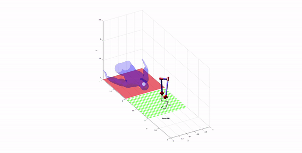

# Robotic brain tumor surgery

This project simulates how to burn a brain tumor with a puma 560. He first takes samples of the tumor, then proceeds with trepanation, and finally burns the tumor.

This project was presented in the Robotics subject at the Barcelona School of Informatics.

## Requirements

Before running the code, make sure you have Matlab's Robotics Toolbox installed.

In order to install the library, follow these steps:

1. Go to the link [Robotics Toolbox](https://petercorke.com/toolboxes/robotics-toolbox/)
2.  Install from shared MATLAB Drive Folder the [RVC 2nd edition: RTB10+MVTB4 (2017)](https://drive.matlab.com/sharing/e668b3b4-a452-464b-8e6e-77280e6cce21)
3. To check the robotics ToolBox is installed at the Command  windows tip 'rtbdemo' a GUI will appear.

## Run

Before running the program, make sure you have the entire "Robotic brain tumor surgery" folder on the path and the Matlab's Robotics Toolbox installed. To run the program you just have to run the project.mlx file.

## Surgery

To see the full video, go to the Videos folder

## Author

- **Marc Domènech i Vila** - *Initial work* - [MarcDV1999](https://github.com/MarcDV1999)

## License

This project is licensed under the MIT License - see the [LICENSE.md](https://github.com/MarcDV1999/Robotic-brain-tumor-surgery/blob/main/LICENSE) file for details

